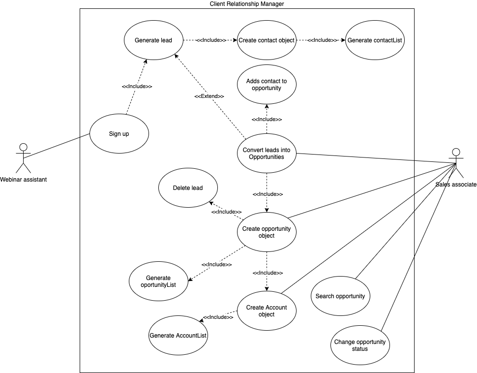
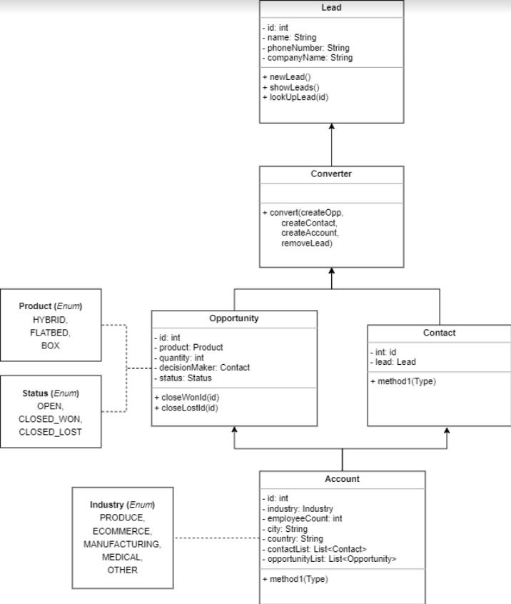

# E.M.O.F. Customer Relationship Manager v1.2

#### [Group A | Weekly Assignment N° 3]


## Use Case Diagram





## Classes Diagram




## Capabilities

This CRM will allow you to:


1. Create Sales Representatives

2. Track Leads (people whose contact info we have gathered but who may or may not be interested our product)

3. Convert Leads into Opportunities (leads are converted into opportunities when they show interest in buying the product)

4. Associate an Opportunity with an Account.

5. Associate Contacts with an Opportunity.

6. Get Reports & Statistics


## Working explanation

We have created unit tests for every method other than basic getters, setters, constructors and methods that required user input.

This program handle all exceptions so incorrect input should not crash the program.

Leads can be added to the CRM by typing the command **New Lead** (case insensitive).

When a new Lead is created the user will be prompted for ```Name```, ```Phone Number```, ```Email```, and ```Company Name```. All fields must be supplied to create the new Lead.

The system automatically creates an ```id``` for the **Lead**. And it keeps track of how many objects have been created and provide the current count as the id for each new object.

A list of all Leads' ```id``` and ```name``` can be displayed by typing **Show Leads** (case insensitive).

An individual Lead's details can be displayed by typing **Lookup Lead [id]** (case insensitive) where **[id]** is the actual ```id``` of the **Lead** to lookup.

A **Lead** can be converted to an **Opportunity** by typing **convert [id]** (case insensitive) where **[id]** is the actual ```id``` of the **Lead** to convert.

When a **Lead** is converted, a **Contact** will be created with the **Lead** contact info and a new ```id```.

When a **Lead** is converted, the user will be prompted for the ```product``` and the ```number of trucks``` for this **Opportunity**. A new **Opportunity** should be created with the above information and with the new **Contact** as the ```decisionMaker``` for the **Opportunity** and a ```status``` of "OPEN". To recap, Opportunity should have the following properties:


    id - a unique identifier

    product - an Enum with options HYBRID, FLATBED, or BOX

    quantity - the number of trucks being considered for purchase

    decisionMaker - a Contact

    status - an Enum with options OPEN, CLOSED_WON, CLOSED_LOST 

    (these are common sales terms indicating an ongoing potential sale, a sale, and an opportunity where a sale was not made and the sale is no longer a possibility)


When a Lead is converted, the user will be prompted for the industry, number of employees, city, and country of the organization. An Account represents the company that is looking to buy a truck. Each Account should have a List of Contacts and a List of Opportunities. To recap, Account should have the following properties:


    id - a unique identifier

    industry - an Enum with options PRODUCE, ECOMMERCE, MANUFACTURING, MEDICAL, OTHER

    employeeCount - a number respresenting the number of employees in the company

    city - a String

    country - a String

    contactList - a List of Contacts associated with this Account

    opportunityList - a list of Opportunities associated with this Account


**Leads** are removed from the system once the have been successfully converted.


**Opportunity** ```status``` can be edited using the command **change status [id]** and then writing ***lost*** or ***won***. Where **[id]** is the ```id``` of the **Opportunity** that should be closed.


**Reporting** allows the user to get different reports by categories.


**Statistics** allows the user to get different ratios.


## Actual use-case

#### Example of CRM

LBL Trucking Company sells fleets of Trucks to large companies all over the world. They need new customers so they decide to offer a free webinar on the cost savings associated with their new hybrid trucks. Ever person who signs up for the webinar becomes a Lead in their CRM. The CRM stores the name, phone number, email address, and company name of each Lead.

Sara is a sales associate at LBL. After the webinar, she starts calling all the new Leads. The first 5 Leads are not interested. The sixth Lead is Mike from Emerson Produce Company. Mike says he is interested in learning more and would like to see their pricing.

Sara needs to convert Mike's Lead to an Opportunity. Mike's Lead id is 134. Sara types "Convert 134" into the CRM.

The CRM begins by creating a new Contact object with the contact information from Mike's Lead object.

The CRM then prompts Sara for the product that Mike is interested in (Hybrid Truck, Flatbed Truck, or Box Truck) and the number of trucks that he is interested in buying. Sara inputs the information "Hybrid Truck" and "30". The CRM creates a new Opportunity object with this information. It adds the new Mike Contact object as the decisionMaker for the Opportunity and sets the status to "OPEN".

The CRM then prompts Sara for the industry, number of employees, city, and country of Mike's company. Sara inputs the information "Produce", "4000", "Berlin", "Germany". The CRM takes the Company name from Mike's Lead Object and creates a new Account Object with this information. It adds the Mike Contact to the contactList of the Account and the new Opportunity to the opportunityList of the Account.

Finally the System deletes the Mike Lead.

The next day Sara wants to look up the new Opportunity. The Opportunity id is 24. She types "lookup opportunity 24". The CRM displays the opportunity information.

She wants to call Mike to check on the deal. Unfortunately, he says they have decided to buy from another truck company. Sara types "close-lost 24" and the CRM changes the status of opportunity 24 to "CLOSED-LOST"

<br>

#### Example of the Reporting feature

Luz is the Director of Sales at LBL Trucking Company. Luz is in trouble. Sales have not been as good as the company projected in January and the board of directors has given them 1 quarter to increase sales by 10%.

Luz needs to quickly determine the most important factors in acquiring Leads, converting a Lead to an Opportunity, and converting an OPEN Opportunity to a CLOSED_WON Opportunity.

All of this information can be found in the reporting feature.

First, she types "Report Lead by SalesRep". The CRM displays the total number of Leads owned by each SalesRep:

> James 142.
> 
> Sara 153
> 
> Michael 126
> 
> Julia 94

Next, Luz types "Report Opportunity by SalesRep". The CRM displays the total number of Opportunities owned by each SalesRep, regardless of their status:

> James 103
>
> Sara 112
>
> Michael 107
>
> Julia 92

Lastly, Luz types "Report CLOSED-WON by SalesRep". The CRM displays the total number of Opportunities owned by each SalesRep with a CLOSED_WON status:

> James 13
>
> Sara 17
>
> Michael 7
>
> Julia 50

It appears that Julia acquires fewer Leads, but has the highest conversion rate by a large margin. Luz asks Julia to train the entire Sales division on how to close sales.

Sales immediately go up by 2%. It's a large improvement, but not significant enough. Fortunately, the reporting feature allows Luz to find Leads, Opportunities, and Opportunities by status not only by SalesRep but also by product, country, city, and industry.

Luz will continue to pull reports and find contributing factors to sales to create a solid sales improvement plan.
